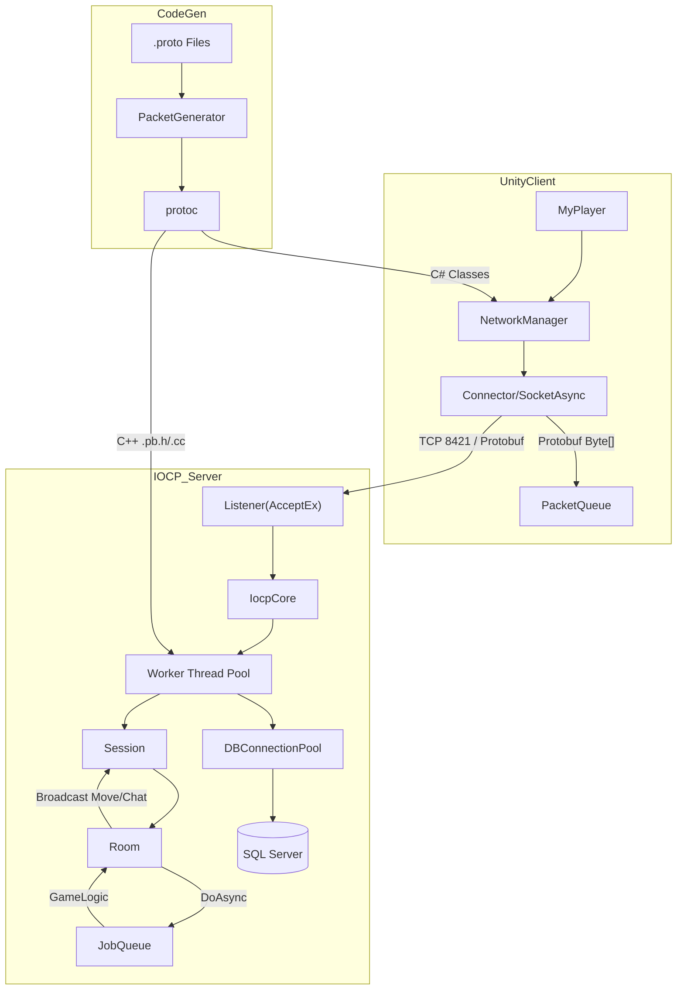

```mermaid
flowchart TD
 subgraph UnityClient["UnityClient"]
        UC_NetMgr["NetworkManager"]
        UC_Player["MyPlayer"]
        UC_Socket["Connector/SocketAsync"]
        UC_Queue["PacketQueue"]
  end
 subgraph IOCP_Server["IOCP_Server"]
        SV_Iocp["IocpCore"]
        SV_Listener["Listener(AcceptEx)"]
        SV_Workers["Worker Thread Pool"]
        SV_Session["Session"]
        SV_Room["Room"]
        SV_JQ["JobQueue"]
        SV_DBPool["DBConnectionPool"]
        SV_DB[("SQL Server")]
  end
 subgraph CodeGen["CodeGen"]
        CG_Tool["PacketGenerator"]
        CG_Proto[".proto Files"]
        CG_Protoc["protoc"]
  end
    UC_Player --> UC_NetMgr
    UC_NetMgr --> UC_Socket
    UC_Socket -- Protobuf Byte[] --> UC_Queue
    SV_Listener --> SV_Iocp
    SV_Iocp --> SV_Workers
    SV_Workers --> SV_Session & SV_DBPool
    SV_Session --> SV_Room
    SV_Room -- DoAsync --> SV_JQ
    SV_JQ -- GameLogic --> SV_Room
    SV_DBPool --> SV_DB
    SV_Room -- Broadcast Move/Chat --> SV_Session
    UC_Socket -- TCP 8421 / Protobuf --> SV_Listener
    CG_Proto --> CG_Tool
    CG_Tool --> CG_Protoc
    CG_Protoc -- C# Classes --> UC_NetMgr
    CG_Protoc -- "C++ .pb.h/.cc" --> SV_Workers

```