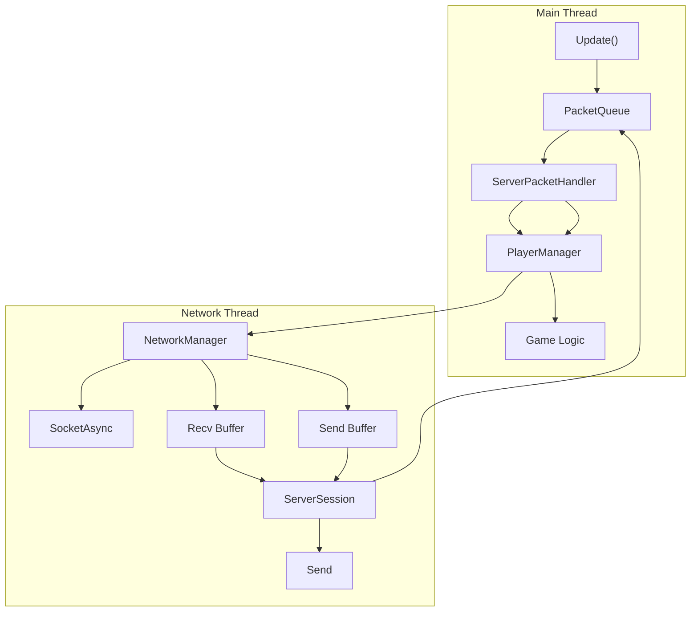

```mermaid
flowchart TD
    subgraph MainThread["Main Thread"]
        MT_Update["Update()"]
        MT_PacketQueue["PacketQueue"]
        MT_PacketHandler["ServerPacketHandler"]
        MT_PlayerManager["PlayerManager"]
        MT_GameLogic["Game Logic"]
        
    end

    subgraph NetworkThread["Network Thread"]
        NT_NetworkManager["NetworkManager"]
        NT_SocketAsync["SocketAsync"]
        NT_RecvBuffer["Recv Buffer"]
        NT_SendBuffer["Send Buffer"]
        NT_ServerSession["ServerSession"]
        NT_Send["Send"]
    end

    %% 네트워크 흐름(수신)
    NT_NetworkManager --> NT_SocketAsync;NT_NetworkManager --> NT_RecvBuffer --> NT_ServerSession --> MT_PacketQueue
    NT_SendBuffer --> NT_ServerSession


    %% 네트워크 흐름 (송신)
    MT_PacketHandler --> MT_PlayerManager --> NT_NetworkManager --> NT_SendBuffer; NT_ServerSession --> NT_Send

    %% 클라이언트 메인 쓰레드 흐름
    MT_Update --> MT_PacketQueue --> MT_PacketHandler --> MT_PlayerManager --> MT_GameLogic
```