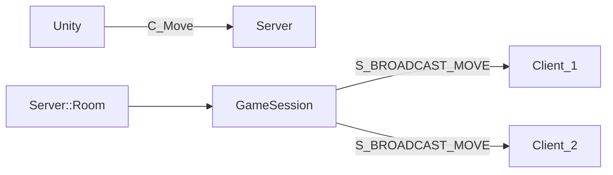
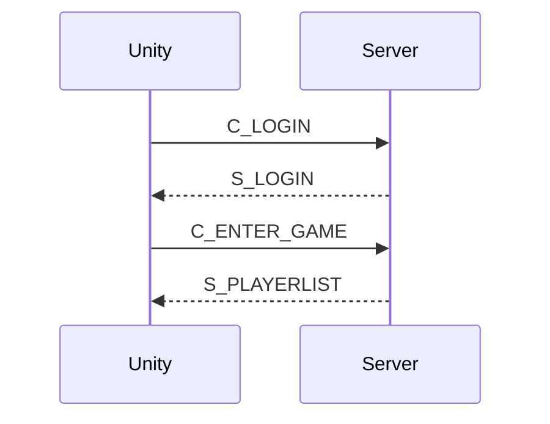

## 1. C_Move 패킷 예시

```mermaid
graph LR;

Unity -- C_Move --> Server

Server::Room --> GameSession -- S_BROADCAST_MOVE --> Client_1
GameSession -- S_BROADCAST_MOVE --> Client_2
```


## 2. 로그인/입장 흐름 

```mermaid
sequenceDiagram 
participant U as Unity
participant S as Server
U->>S: C_LOGIN
S-->>U: S_LOGIN
U->>S: C_ENTER_GAME
S-->>U: S_PLAYERLIST
```

## 3. 채팅 송수신
```mermaid
```