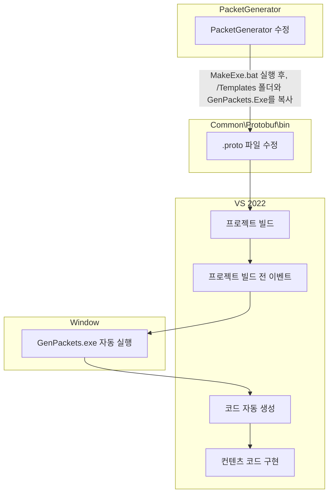

<table>
  <tr>
    <td></td>
  </tr>
</table>

<div align="center">

# **C++ IOCP Server ↔ C# Unity Client Demo**

**실전 수준의 크로스 플랫폼 멀티플레이어 게임 서버 데모**

**🚀 학습용 최소 예제를 넘어선 실전 활용 가능한 구조**

______________________________________________________________________

</div>

## 🎯 **프로젝트 목표**

본 프로젝트는 **단순한 학습용 예제를 넘어선 실전 수준의 멀티플레이어 게임 서버 솔루션**을 제공합니다.

### **🔥 핵심 차별화 포인트**

#### **1. 실전 수준의 패킷 시스템**
- 기본 강의의 최소한 예제가 아닌 **실제 게임에서 사용할 법한 핵심 패킷들** 구현
- **Move Broadcasting**: 실시간 위치 동기화로 멀티플레이어 환경 구현
- **Chat Broadcasting**: 실시간 채팅 시스템으로 소셜 기능 구현
- **Player Management**: 입장/퇴장 처리와 플레이어 목록 관리

#### **2. 크로스 플랫폼 아키텍처**
- 기존 **C# ↔ C#**, **C++ ↔ C++** 동일 언어 구조가 아닌
- **C++ IOCP Server ↔ C# Unity Client** 이종 언어 간 완벽 호환
- **Google Protobuf**를 통한 언어 독립적 직렬화
- 실제 상용 게임에서 사용하는 **고성능 서버 + 유연한 클라이언트** 구조

#### **3. 완전 자동화된 개발 환경**
- `.proto` 파일 기반 **패킷 코드 자동 생성**
- **누구나 쉽고 빠르게** 데모 실행 가능한 구조
- 각 모듈별 독립적 테스트 시나리오 제공

## 🛠️ **시스템 아키텍처**

```
┌─────────────────┐    Protobuf     ┌─────────────────┐
│  C++ IOCP       │◄─────────────►  │  C# Unity       │
│  Game Server    │   TCP Socket    │  Client         │
├─────────────────┤                 ├─────────────────┤
│ • Session Mgmt  │                 │ • NetworkManager│
│ • Packet Mgmt   │                 │ • UI System     │
│ • Room System   │                 │ • Player Mgmt   │
│ • DB Connection │                 │ • JobQueue      │
│ • Memory Pool   │                 │ • Packet Queue  │
│ • IOCP Core     │                 │ • Scene Mgmt    │
└─────────────────┘                 └─────────────────┘
```

## 🎮 **주요 기능**

### **실시간 멀티플레이어 시스템**
- ✅ **Login/Logout**: 플레이어 인증 및 세션 관리
- ✅ **Enter/Leave Game**: 방 입장/퇴장 및 브로드캐스팅
- ✅ **Real-time Movement**: 실시간 위치 동기화 (.gif 참조)
- ✅ **Live Chat System**: 실시간 채팅 브로드캐스팅
- ✅ **Player Count Display**: 현재 접속자 수 실시간 표시

### **고성능 서버 코어**
- ✅ **IOCP 비동기 소켓**: Windows 최적화 고성능 I/O
- ✅ **Memory Pool & Object Pool**: 메모리 관리 최적화
- ✅ **Connection Pool**: DB 연결 풀링

### **자동화 도구**
- ✅ **PacketGenerator**: .proto → C++/C# 코드 자동 생성
- ✅ **ProcedureGenerator**: DB 프로시저 코드 자동 생성

## 🚀 **Quick Start**

### **1. 서버 실행**
```bash
# Visual Studio에서 빌드 후
cd iocp_server_cpp/Binary/Release/
GameServer.exe
```

### **2. Unity 클라이언트 실행**
```bash
# Unity에서 빌드 후 혹은 유니티 Inspector에서
cd unity_client_csharp/Build/
Client.exe
```

### **3. DummyClient 테스트 (C++ / C#)**
```bash
# C++ DummyClient (기존)
cd iocp_server_cpp/Binary/Release/
DummyClient.exe

# C# DummyClient (신규 추가)
cd iocp_server_cpp/DummyClientCS/bin/Release/net9.0/
DummyClientCS.exe
```

## 🛠️ **자동화 도구 사용법**

본 프로젝트는 **Protobuf를 사용한 패킷 자동화와 Jinja2를 사용한 코드 자동화**를 통해 개발 생산성을 극대화합니다.

## 🔄 **패킷/코드 자동화 워크플로우**


## 🧪 **테스트 시나리오 [예정]**

### **시나리오 1: Unity Client 데모**
1. 서버 실행 → Unity 클라이언트 실행
2. 로그인 → 게임 입장 → 실시간 이동
3. 채팅 송수신 → 다른 플레이어와 상호작용

### **시나리오 2: 부하 테스트**
1. 서버 실행 → DummyClient (C++/C#) 다중 실행
2. 자동 로그인 → 랜덤 이동 패킷 송신
3. 주기적 채팅 → 성능 모니터링 → **Google Test** 기반 성능 측정

### **시나리오 3: 크로스 플랫폼 테스트**
1. C++ 서버 + Unity Client + DummyClient (C++/C#) 동시 실행
2. 서로 다른 언어/플랫폼 간 완벽 호환 확인

## 📚 **학습 기반**

본 프로젝트는 [Rookiss님의 Inflearn 강의 시리즈]를 기반으로 하되, 실전 수준으로 확장했습니다:

- [C++과 언리얼로 만드는 MMORPG 게임 개발 시리즈 Part4: 게임 서버](https://www.inflearn.com/course/%EC%96%B8%EB%A6%AC%EC%96%BC-3d-mmorpg-4/dashboard)  
- [C#과 유니티로 만드는 MMORPG 게임 개발 시리즈 Part4: 게임 서버](https://www.inflearn.com/course/%EC%9C%A0%EB%8B%88%ED%8B%B0-mmorpg-%EA%B0%9C%EB%B0%9C-part4)

**🎓 강의 vs 본 프로젝트**

| 구분 | 기존 강의 | 본 프로젝트 |
|------|-----------|------------|
| **통신 구조** | C# ↔ C# 또는 C++ ↔ C++ | **C++ ↔ C# 크로스 플랫폼** |
| **패킷 종류** | 기본적인 예제 패킷 | **실전 Move/Chat Broadcasting** |
| **복잡도** | 학습용 최소 예제 | **실전 활용 가능한 구조** |
| **확장성** | 제한적 | **모듈화된 확장 가능 구조** |

## 🧩 **기술 스택**

### **Server (C++)**
- Windows 환경 / Visual Studio 2022
- WinSock2 IOCP / Multi-threading
- Google Protobuf 3.21.12
- MSSQL Server / ODBC

### **Client (C# Unity)**
- Unity 6000.1.7f1
- Google.Protobuf 3.21.12
- System.Memory, System.Buffers
- UI Toolkit / Input System

### **Development Tools**
- Python 3.10 (PacketGenerator)
- Jinja2 3.1.6 (Code Template)
- Pyinstaller (Executable Build)
- Google Test (Unit Test & Performance Testing)

## 📈 **개발 로드맵**

### **✅ 완료된 기능**
- [x] C++ IOCP 서버 코어
- [x] C# Unity 클라이언트
- [x] C# DummyClient 구현
- [x] Protobuf 패킷 시스템
- [x] 실시간 Move/Chat Broadcasting
- [x] 자동화 패킷 생성 도구

### **🚧 진행 중**
- [ ] **성능 벤치마크**: 로그인 → 이동 100회 → 채팅 10회 → 종료 시나리오
- [ ] **부하 테스트**: DummyClient (C++/C#) 동시 접속자 수별 TPS 측정
- [ ] **Google Test 통합**: 단위 테스트 및 성능 측정 자동화
- [ ] **모니터링 도구**: 실시간 성능 지표 대시보드

### **📋 계획 중**
- [ ] Docker 컨테이너화
- [ ] CI/CD 파이프라인
- [ ] 클라우드 배포 가이드
- [ ] 추가 게임 로직 (인벤토리, 전투 등)

## 🤝 **기여하기**

이 프로젝트는 **실전 수준의 게임 서버 학습**을 목표로 합니다. 
버그 리포트, 기능 제안, Pull Request 모두 환영합니다!

## 📄 **라이센스**

본 프로젝트는 학습 목적으로 제작되었으며, Rookiss님의 강의 내용을 기반으로 확장되었습니다.
