<table>
  <tr>
    <td></td>
  </tr>
</table>

<div align="center">

# **C++ IOCP Server ↔ C# Unity Client Demo**

**실전 수준의 서버-클라이언트 크로스 플랫폼 멀티플레이어 게임 서버 데모**

**🚀 학습용 최소 예제를 넘어선 실전 활용 가능한 구조**

______________________________________________________________________

</div>

## 🎯 **프로젝트 목표**

본 프로젝트는 **단순한 학습용 예제를 넘어선 실전 수준의 멀티플레이어 게임 서버 솔루션**을 제공합니다.

### **🔥 핵심 차별화 포인트**

- **실전 수준의 패킷 시스템**: Move/Chat Broadcasting, Player Management
- **크로스 플랫폼 아키텍처**: C++ IOCP Server ↔ C# Unity Client 완벽 호환
- **완전 자동화**: 패킷 코드 자동 생성, 성능 테스트 자동화
- **🆕 실시간 성능 모니터링**: TPS, 지연시간, 패킷 처리량 실시간 수집

## 🛠️ **시스템 아키텍처**

```
┌─────────────────┐    Protobuf     ┌─────────────────┐
│  C++ IOCP       │◄─────────────►  │  C# Unity       │
│  Game Server    │   TCP Socket    │  Client         │
├─────────────────┤                 ├─────────────────┤
│ • Session Mgmt  │                 │ • NetworkManager│
│ • Packet Mgmt   │                 │ • UI System     │
│ • Room System   │                 │ • Player Mgmt   │
│ • Memory Pool   │                 │ • Packet Queue  │
│ • 📊 Stats Core │                 │ • 📊 Stats Mgmt │
└─────────────────┘                 └─────────────────┘
         │                                   │
         └─────────── Google Test ───────────┘
                   📈 Performance Testing
```

## 🚀 **Quick Start**

### **1. 🎯 원클릭 성능 테스트 (추천)**
```bash
cd iocp_server_cpp/PerformanceTest/scripts/
.\build_and_test_real_network.bat
```

**이 명령 하나로 모든 것이 자동 실행됩니다:**
- 🔨 CMake 빌드 → 🚀 GameServer 시작 → 👥 다중 클라이언트 실행
- 🌐 실제 네트워크 통신 테스트 → 📊 성능 리포트 생성 → 🧹 자동 정리

### **2. 개별 실행**

```bash
# 서버 실행
cd iocp_server_cpp/Binary/Release/
GameServer.exe

# Unity 클라이언트 실행
cd unity_client_csharp/Build/
Client.exe

# C# DummyClient 실행
cd iocp_server_cpp/DummyClientCS/bin/Release/net9.0/
DummyClientCS.exe
```

## 🎮 **주요 기능**

### **실시간 멀티플레이어 시스템**
- ✅ **Login/Logout**: 플레이어 인증 및 세션 관리
- ✅ **Real-time Movement**: 실시간 위치 동기화 (.gif 참조)
- ✅ **Live Chat System**: 실시간 채팅 브로드캐스팅
- ✅ **Player Count Display**: 현재 접속자 수 실시간 표시

### **🆕 실시간 성능 모니터링**
- ✅ **서버/클라이언트 통계 수집**: TPS, 지연시간, 패킷 처리량
- ✅ **자동 파일 정리**: 테스트 후 요약 파일 생성
- ✅ **실제 네트워크 성능 측정**: 가상 시뮬레이션이 아닌 실제 TCP/IP 통신

> 📊 **성능 테스트 가이드**: [`iocp_server_cpp/PerformanceTest/README.md`](iocp_server_cpp/PerformanceTest/README.md) | [`iocp_server_cpp/LoadTest/README.md`](iocp_server_cpp/LoadTest/README.md)

## 🛠️ **자동화 도구 사용법**

본 프로젝트는 **Protobuf를 사용한 패킷 자동화와 Jinja2를 사용한 코드 자동화**를 통해 개발 생산성을 극대화합니다.

## 🔄 **패킷/코드 자동화 워크플로우**

```mermaid
flowchart TD
 subgraph Common\Protobuf\bin["Common\Protobuf\bin"]
    CPB_A[".proto 파일 수정"]
 end
 subgraph Visual_Studio["VS 2022"]
    VS_Build["프로젝트 빌드"]
    VS_PreBuild["프로젝트 빌드 전 이벤트"]
    VS_CodeGen["코드 자동 생성"]
    VS_Impl["컨텐츠 코드 구현"]
 end
 subgraph OS["Window"]
    OS_Batch["GenPackets.exe 자동 실행"]
 end
 subgraph PacketGenerator["PacketGenerator"]
    PG_Revise["PacketGenerator 수정"]
 end

    CPB_A --> VS_Build
    VS_Build --> VS_PreBuild
    VS_PreBuild --> OS_Batch
    OS_Batch --> VS_CodeGen
    VS_CodeGen --> VS_Impl
    PG_Revise -- MakeExe.bat 실행 후, /Templates 폴더와 GenPackets.Exe를 복사 --> CPB_A
    

```




## 🧪 **부하테스트 & 성능 분석**

### **📂 LoadTest - 실시간 모니터링 부하테스트**
```bash
cd iocp_server_cpp/LoadTest/scripts/
.\quick_test.bat          # 30초 빠른 테스트
.\gradual_load_test.bat   # 점진적 부하테스트 (1->5->10->...->30 클라이언트)
```
- **🎯 실시간 모니터링**: Prometheus + Grafana 대시보드 (http://localhost:3000)
- **📊 시각적 분석**: TPS, 지연시간, 메모리 사용량 실시간 추적
- **🔄 점진적 증가**: 성능 한계점 자동 탐지

> 📋 **상세 가이드**: [`iocp_server_cpp/LoadTest/README.md`](iocp_server_cpp/LoadTest/README.md)

### **📂 PerformanceTest - 실제 네트워크 성능 측정**
```bash
cd iocp_server_cpp/PerformanceTest/scripts/
.\build_and_test_real_network.bat
```
- **🌐 실제 TCP 통신**: GameServer.exe + DummyClientCS.exe 실제 실행
- **📈 성능 리포트**: CSV/XML/JSON 형식 자동 생성
- **🧪 Google Test**: 단위 테스트 프레임워크 기반
- **📊 통계 수집**: client_stats_*.json (gTest 환경에서만)

> 📋 **상세 가이드**: [`iocp_server_cpp/PerformanceTest/README.md`](iocp_server_cpp/PerformanceTest/README.md)

### **🎮 테스트 시나리오 비교**

| 구분 | LoadTest | PerformanceTest |
|------|----------|----------------|
| **목적** | 실시간 부하 모니터링 | 정확한 성능 측정 |
| **모니터링** | Grafana 대시보드 | 리포트 파일 생성 |
| **클라이언트 수** | 점진적 증가 (1→30) | 고정 (코드 설정) |
| **JSON 생성** | ❌ 생성 안됨 | ✅ gTest 모드에서만 |
| **실행 시간** | 5분 (점진적) | 45초 (고정) |

## 📚 **학습 기반**

본 프로젝트는 [Rookiss님의 Inflearn 강의 시리즈]를 기반으로 실전 수준으로 확장했습니다:

- [C++과 언리얼로 만드는 MMORPG 게임 개발 시리즈 Part4: 게임 서버](https://www.inflearn.com/course/%EC%96%B8%EB%A6%AC%EC%96%BC-3d-mmorpg-4/dashboard)  
- [C#과 유니티로 만드는 MMORPG 게임 개발 시리즈 Part4: 게임 서버](https://www.inflearn.com/course/%EC%9C%A0%EB%8B%88%ED%8B%B0-mmorpg-%EA%B0%9C%EB%B0%9C-part4)

**🎓 강의 vs 본 프로젝트**

| 구분 | 기존 강의 | 본 프로젝트 |
|------|-----------|------------|
| **통신 구조** | C# ↔ C# 또는 C++ ↔ C++ | **C++ ↔ C# 크로스 플랫폼** |
| **패킷 종류** | 기본적인 예제 패킷 | **실전 Move/Chat Broadcasting** |
| **성능 측정** | 없음 | **🆕 실시간 통계 수집 + Google Test** |
| **테스트 자동화** | 수동 테스트 | **🆕 원클릭 완전 자동화** |
| **복잡도** | 학습용 최소 예제 | **실전 활용 가능한 구조** |

## 🧩 **기술 스택**

### **Server (C++)**
- Windows / Visual Studio 2022 / WinSock2 IOCP
- Google Protobuf 3.21.12 / ~~MSSQL Server (미구현)~~

### **Client (C# Unity)**
- Unity 6000.1.7f1 / Google.Protobuf 3.21.12

### **Testing & Automation**
- Google Test 3.21.12 / 실시간 JSON 로깅
- Python 3.10 (PacketGenerator) / CMake 3.20+
- **🆕 Prometheus + Grafana**: 실시간 부하테스트 모니터링
- **🆕 Docker Compose**: 원클릭 모니터링 환경

## 📈 **성능 기준값 (실측) -- 이 부분은 추후 보완 예정**

| 항목 | 단일 클라이언트 | 3 클라이언트 | 5 클라이언트 |
|------|----------------|-------------|-------------|
| **서버 TPS** | 6.00 | 18.00 | 30.00 |
| **평균 지연시간** | 8.30ms | 8.90ms | 9.50ms |
| **패킷 손실률** | 1.00% | 1.00% | 1.00% |

> 📊 **상세한 성능 데이터**: [`iocp_server_cpp/PerformanceTest/README.md`](iocp_server_cpp/PerformanceTest/README.md) 참조

## 📋 **프로젝트 구조 & 다이어그램**

### **📂 폴더 구조**
```
iocp-server-unity-client-demo/
├── 📂 iocp_server_cpp/          # C++ 서버 & 테스트
│   ├── 📂 LoadTest/             # 실시간 모니터링 부하테스트
│   ├── 📂 PerformanceTest/      # 실제 네트워크 성능 측정
│   ├── 📂 GameServer/           # 메인 게임 서버
│   └── 📂 DummyClientCS/        # C# 테스트 클라이언트
├── 📂 unity_client_csharp/      # Unity 클라이언트
└── 📂 docs/diagram/             # 시스템 다이어그램
```

### **📊 시스템 다이어그램**
- **컴포넌트 구조**: [`docs/diagram/01_Compoenent_diagram.md`](docs/diagram/01_Compoenent_diagram.md)
- **서버 아키텍처**: [`docs/diagram/02_Server_diagram.md`](docs/diagram/02_Server_diagram.md)  
- **클라이언트 구조**: [`docs/diagram/03_Client_diagram.md`](docs/diagram/03_Client_diagram.md)
- **패킷 시퀀스**: [`docs/diagram/04_Packet_Sequence_diagram.md`](docs/diagram/04_Packet_Sequence_diagram.md)

## 🤝 **기여하기**

이 프로젝트는 **실전 수준의 게임 서버 학습**을 목표로 합니다. 
버그 리포트, 기능 제안, Pull Request 모두 환영합니다!

## 📄 **라이센스**

본 프로젝트는 학습 목적으로 제작되었으며, Rookiss님의 강의 내용을 기반으로 확장되었습니다.

---

<div align="center">

**🚀 실전 수준의 게임 서버를 경험해보세요!**

**📊 실시간 모니터링**: `cd iocp_server_cpp/LoadTest/scripts/ && .\quick_test.bat`  
**🧪 성능 측정**: `cd iocp_server_cpp/PerformanceTest/scripts/ && .\build_and_test_real_network.bat`

**📋 자세한 가이드**: [`LoadTest`](iocp_server_cpp/LoadTest/README.md) | [`PerformanceTest`](iocp_server_cpp/PerformanceTest/README.md) | [`Diagrams`](docs/diagram/)

</div>
